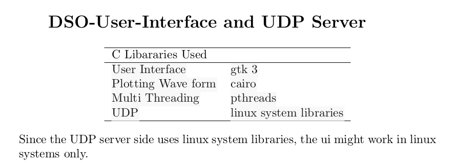
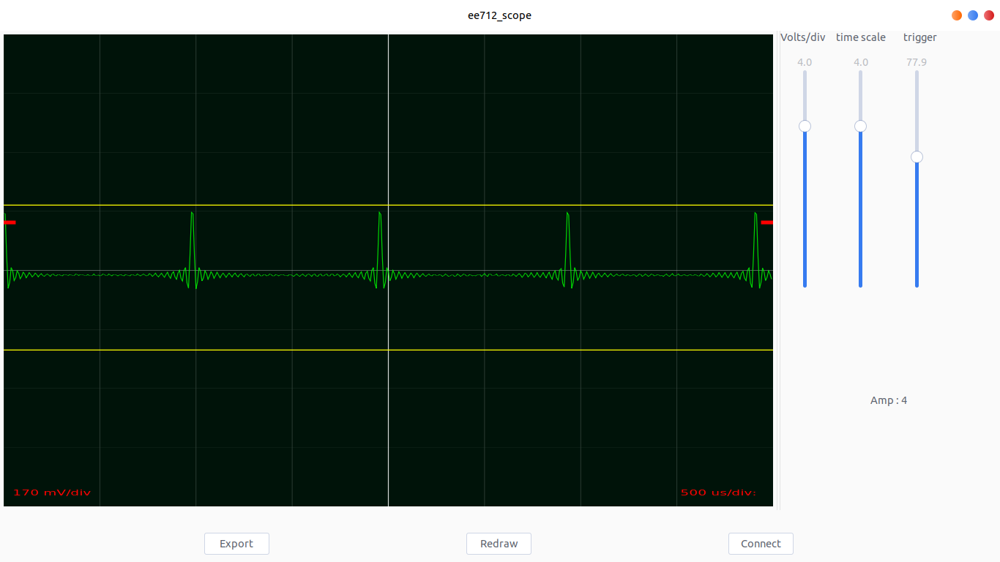

# ScopeUI
small gtk + app to plot data recieved over wifi

#Abstract 
  The project aims at creating wireless DSO module. Which will sample and the analog voltage levels with a TivaC development board 
  and send the data over a wifi link using CC3100 addon board . This particular repository contains the code for the reception part. 
  the code is written entirely in C. 
      
     
 
      
The program is multithreaded to address any dead lock issue. Cairo library is used for drawing ui 


##dependencies 
	GTK3			sudo apt-get install libgtk-3-dev
	glib			sudo apt-get install libglib2.0-0 
	cairo			sudo apt-get install libcairo2
	for all the build tools sudo apt-get install build-essentials


##building and running the project 
	use the make file provided in the project root
	```make```
	for building the project

	```make run``` to launch the ui 

	click on the connect button . now the ui can start recieving UDP packets 

###code for Tiva board is available at [wifi DSO module project by aswinajayan](https://github.com/aswinpajayan/wifi-DSO-module)
